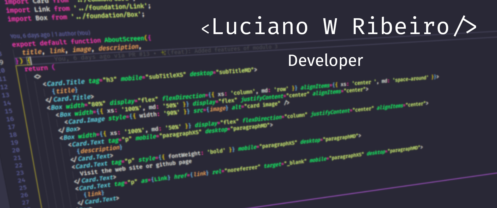

<a href="mailto:lucianowribeiro@gmail.com"> 

<h3> Hi, I'm Luciano 👋</h3>

- ⚡ I’m degrred in System Analisys and Development by Fatec SCS.
- 💬 I had 3 years experience with Jr Developer at @Visto-Tecnologia.
-  🔭 I have better experience in frontend stack but at moment I'm learning backend with Java(Spring) and frameworks Nodejs.   
- My stack : Typescript (ReacJS and frameworks NodeJS) and Java(Spring).

  
  

